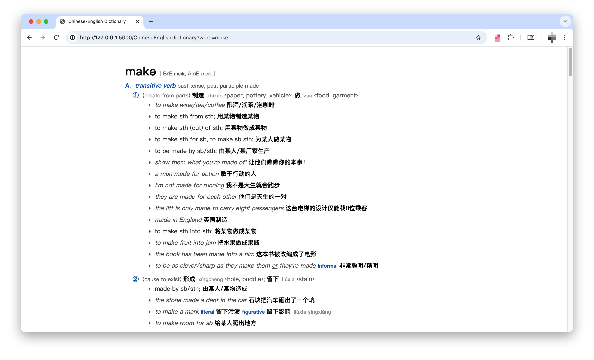
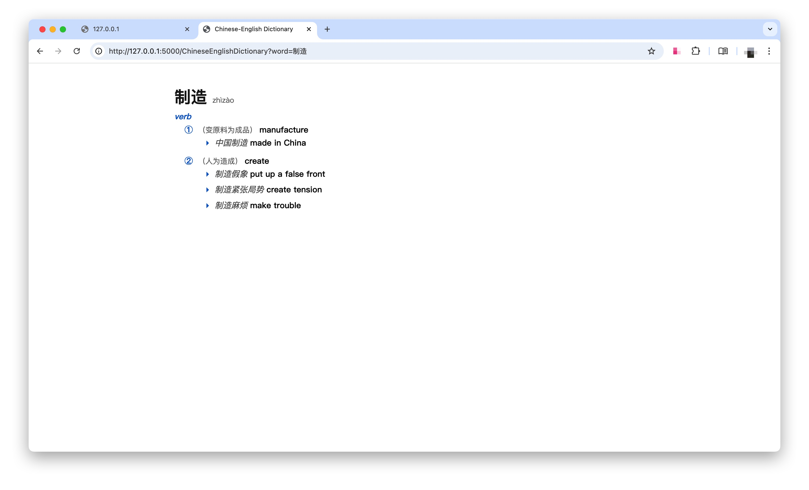
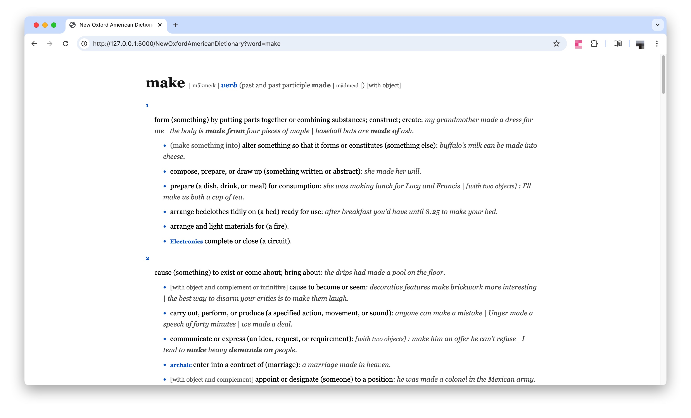

# Apple Dictionary on Web

I extracted the Chinese-English Dictionary and the New Oxford American Dictionary from the built-in Dictionary App on MacOS and put them on a simple web server. It's hard to find ad-free dictionaries nowadays, so I made one by myself.

## Screenshots







## Install Python

Install Python. The project uses Flask on Python 3.13. Other Python versions may also work.

## Create a Virtual Environment

In the project root directory run:

```bash
python3 -m venv .venv
```

This will create a virtual environment in the .venv folder in the project.

Activate the virtual environment:

```bash
source .venv/bin/activate
```

You should see something like this in your terminal when the virtual environment is activated:

> (.venv) ➜ apple-dictionary-on-web git:(main)

Notice the `(.venv)` part appears.

## Install Dependencies

Install Flask and its dependencies.

```bash
pip install -r requirement.txt
```

## Unzip the Dictionary files

Unzip the `Dictionaries.zip` file in the `db` folder and put the `*.db` files **directly** in the `db` folder.

## Start the Debug Server

Run the command in the project root directory:

```bash
flask run --debug
```

Navigate to `http://127.0.0.1:5000`, select a dictionary and look up a word.

## API

You can deploy the project on your server and use the following APIs to look up a word. This can be useful if you use calibre e-book reader where you can configure an ad-free dictionary.

```text
/NewOxfordAmericanDictionary?word=<English Word>

/ChineseEnglishDictionary?word=<English Word or Chinese Word>
```
